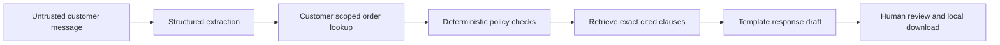

# ReturnDesk

A support-agent prototype that turns a return request into a policy-backed recommendation and a reviewable response draft. It combines LLM extraction with deterministic eligibility rules, customer-scoped order lookup, and exact policy citations.

## Problem and workflow

A support agent must understand a customer's request, locate the right order, check return conditions, and write a response. ReturnDesk puts the extracted fields, order details, recommendation, source clauses, and draft on one screen. A human verifies the result before marking it reviewed locally.

Example: “My order ORD-1001 arrived broken.” Live mode extracts a damage claim; code routes it to human review and retrieves the damage policy. It does not approve or issue a refund.

All orders and policies are fictional. The demo clock is fixed at **September 27, 2026**. Amounts are stored as USD cents. No real customer data, real store policy, saved payment credentials, outbound messages, or refund integrations are used.

## Start locally

Use Python 3.12 or newer:

```bash
python3 -m venv .venv
source .venv/bin/activate
pip install -r requirements.txt
streamlit run app.py --server.port 8504
```

Open http://localhost:8504. Offline examples require no API account.

For live extraction, copy `.env.example` to `.env` and set `GROQ_API_KEY` locally. The default model is `qwen/qwen3.8-27b`; availability depends on Groq. Never commit the key. Only the supplied message is sent to Groq, alongside the extraction schema; order records are not sent. Do not use real customer information in this prototype.

```bash
cp .env.example .env
```

Restart the app after changing credentials. Choose **Live AI** to interpret paraphrases such as “still sealed” or “arrived broken.” Offline mode is a deliberately limited keyword parser, not an LLM simulator. It recognizes the phrases `changed my mind`, `damaged`, `unopened`, `original condition`, and `used`.

## Architecture



- Pydantic restricts extracted fields to order ID, reason, and condition. The model cannot set customer identity or approval.
- Parameterized SQLite queries include customer scope. Unknown and inaccessible order IDs receive the same clarification response.
- Code evaluates inclusive 30-day returns and 7-day damage review boundaries. Final-sale damage claims still reach a human.
- Evidence is selected by exact policy clause IDs used in the decision, **not semantic/vector retrieval**. This deliberately small policy set does not need a vector database.
- Draft wording is deterministic; generative response writing is intentionally excluded to prevent unsupported commitments.
- Review state is local to the Streamlit session. Editing a reviewed draft requires marking it reviewed again. Downloads do not send messages or change orders.

## Verification

```bash
python -m pytest -q
python -m returndesk.evaluate
```

The initial local run passed **38 tests** and **30/30 developer-authored offline decision cases**. Tests cover ownership isolation, parameterized lookups, inclusive policy boundaries, damage exceptions, final-sale precedence, invalid delivery dates, read-only workflow behavior, schema constraints, and UI review gating.

Three live Groq smoke cases also passed: a damage paraphrase, an unopened-return paraphrase at day 30, and an expired return containing an instruction to ignore policy. These are narrow smoke checks, not a live accuracy benchmark.

`reports/evaluation.json` records the labeled decision results. Those results do not measure LLM extraction accuracy: the offline parser, decision rules, and policy fixtures are controlled. Prompt-injection examples exercise only the offline workflow in this report. Passing those examples is not proof that a live model resists attacks.

## Docker

```bash
docker build -t returndesk .
docker run --rm -p 127.0.0.1:8504:8501 --env-file .env returndesk
```

Omit `--env-file .env` for offline-only mode. The Docker configuration is provided; see the verification report for what was actually exercised locally.

## Scope and limitations

This is a prototype, not a production support system. Customer identity is fixed demo context, not authenticated identity. An in-memory SQLite fixture database is created for each workflow. There is no persistent review audit log, real order integration, access-control service, or policy deployment process.

A model may misread negation, ambiguity, or injected instructions. The human must check the displayed extracted fields before relying on the decision. Rules protect the decision surface but cannot establish that a customer's claims are true. Multiple-order messages and unsupported issues need clarification.

Policy text and code are maintained together manually; automated consistency across arbitrary policy documents is not claimed. No handling-time reduction, refund accuracy on real cases, user adoption, or business savings have been measured.

Useful next validation: a separately authored paraphrase test set for live extraction, supervised trials with support agents, persistent review records, and real authentication before any real data integration.

## Public portfolio deployment

Deploy `public_app.py` (not `app.py`) on Streamlit Community Cloud. It forces offline mode even if a Groq key is present, does not load `.env`, and removes the live mode control. Do not upload any secrets for this public demo.

Settings: repository `b-amit11/return-desk`, branch `main`, entrypoint `public_app.py`, Python 3.12. The repository must exist before deployment. The public demo demonstrates policy decisions and human review; it does not claim to run a live model.

To preview this exact entrypoint locally:

```bash
streamlit run public_app.py --server.port 8505
```
